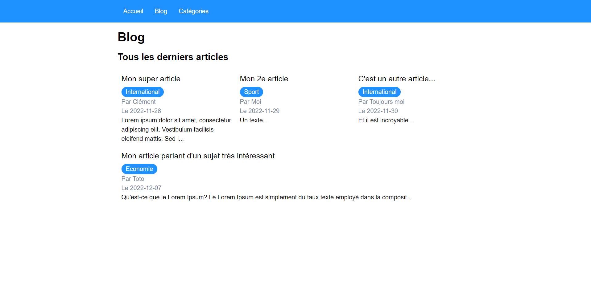

# TP PHP MVC SOLUTION



<br>

> Ce dépôt est une solution au TP suivant : https://github.com/ClementBallet/php-mvc

## Initialisation du projet

- Cloner le dépôt
- Installer composer (https://getcomposer.org/download/) si ce n'est pas déjà fait et redémarrer le pc
- Créer une base de données et importer les données du fichier SQL fourni
- Dans un terminal à la racine du projet, lancer la commande `composer install` pour installer les dépendances du
  projet (le dossier `/vendor` est alors créé automatiquement à la racine du projet pour y mettre toutes les dépendances
  ramenées)
- Créer un fichier `.env` à la racine du projet et renseigner les constantes requises pour la connexion à la base de
  données, en remplaçant les valeurs :

```  
DB_HOST = "localhost"
DB_USER = "root"
DB_PASSWORD = "root"
DB_NAME = "ma_bdd" 
```

